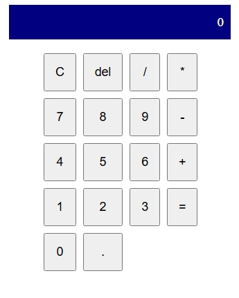

# Kalkulator Sederhana

Aplikasi kalkulator sederhana menggunakan **HTML, CSS Grid, dan JavaScript**.

## Cara Menjalankan
1. Clone repo ini atau buka langsung melalui GitHub Pages.
2. Buka file `index.html` di browser.

## Screenshot

## Demo Online
Klik link berikut untuk mencoba langsung:  
👉 https://eriknofrarama.github.io/kalkulator_sederhana/
